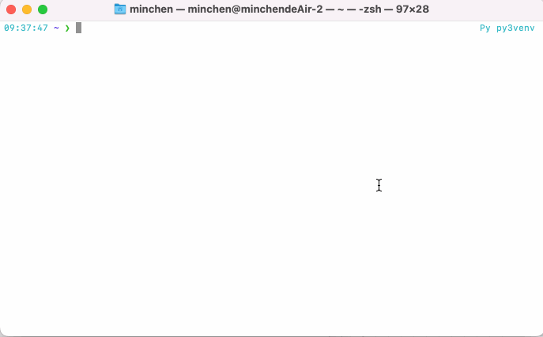
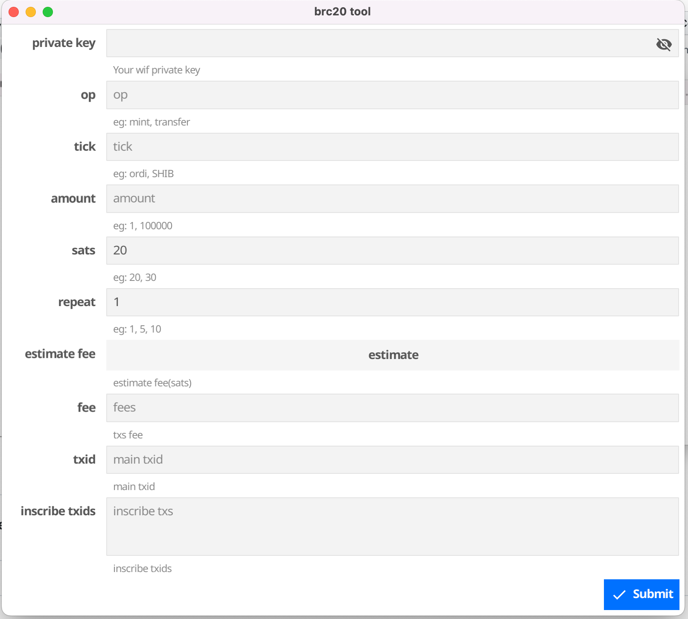

# ord tool

## Based on `go-ord-tx` development

### 目前只支持了bc1p地址, 需要导出WIF格式私钥使用(L开头)

### 请尽量使用空地址(未持有brc20)的地址去打, 且打完一次等区块确认后再下一次,以免出现问题

## usage: 

1. 安装go语言环境

2. cmd运行 `GOPROXY=https://goproxy.cn go run github.com/minchenzz/brc20tool@latest`

## 给开发者来一杯咖啡?

#### ETH/ARB/OP 0x52450DCE61E3352528e5048378Dfd97fd61Aa6df